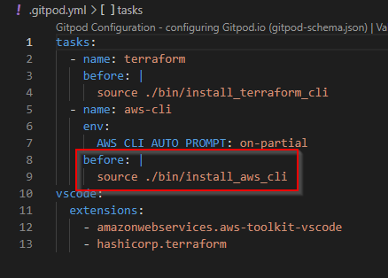
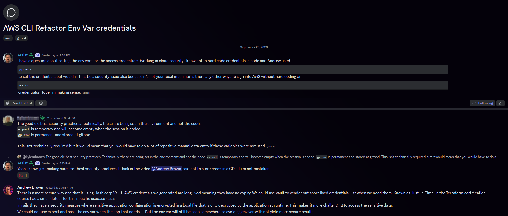
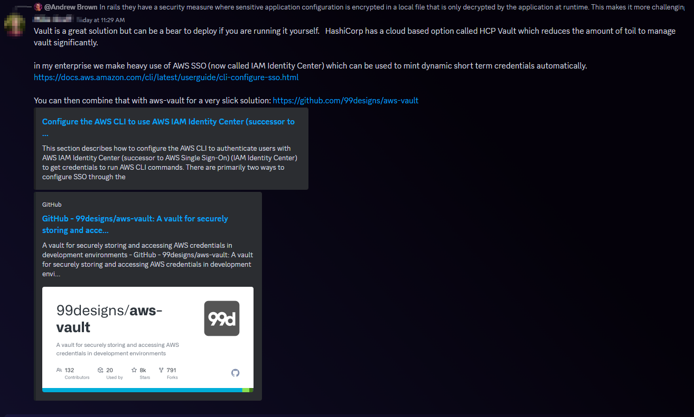

## AWS CLI in a Snap :recycle:

This prerequiste is the same from last time. We had to create another file in bin called `.install_aws_cli` and added the commands that installed the CLI[<sup>[1]</sup>](#references).

```bash
#!/usr/bin/env bash

cd /workspace

curl "https://awscli.amazonaws.com/awscli-exe-linux-x86_64.zip" -o "awscliv2.zip"
unzip awscliv2.zip
sudo ./aws/install

cd $PROJECT_ROOT
```
Afterwards, we had to change the permissions of the file to make sure whenever the workspace get launched again it is executable.

```bash
chmod u+x ./bin/install_aws_cli
```
Next, I changed the YAML to exectue the file using source.



Lastly, we had to set the environment variables[<sup>[2]</sup>](#references) in the Gitpod secret manager using the ```gp env``` command.

```bash
gp env AWS_ACCESS_KEY_ID=' '
gp env AWS_SECRET_ACCESS_KEY=' '
gp env AWS_DEFAULT_REGION=us-east-1
```

And whenever we start the workspace and do a `aws sts get-caller-identity`[<sup>[3]</sup>](#references) we get JSON code confirming we are using the credentials.

```json
{
    "UserId": "AIDASAMPLEUSERID",
    "Account": "123456789012",
    "Arn": "arn:aws:iam::123456789012:user/DevAdmin"
}
```

We're gonna commit our changes, make a PR, and tag our main branch with ```0.4.0```.

## Considerations

- I had some security concerns especially using env var to store them. You should **NEVER** hard code credintials in a file or in a cloud development environment aka the ```gp env``` common but since this is a bootcamp and my IAM user will temporary we chose this route. I asked Andrew in the Discord server for any best practices he knows of and this was his response.
  



> Had another bootcamper give his security suggestions[<sup>[4]</sup>](#references)[<sup>[5]</sup>](#references)

-  We'll need to generate AWS CLI credentials from the IAM service in the portal in order to use the AWS CLI. Security best practice is to set MFA so don't forget to do that.

- You prevent environment variables from being committed to your repository when configuring AWS credentials for Terraform by storing the environment variables in a separate file and adding it to the `.gitignore` file.


## References
- [AWS CLI Install](https://docs.aws.amazon.com/cli/latest/userguide/getting-started-install.html)<sup>[1]</sup>

- [AWS CLI Env Var](https://docs.aws.amazon.com/cli/latest/userguide/cli-configure-envvars.html)<sup>[2]</sup>

- [AWS STS get-caller-identity](https://docs.aws.amazon.com/cli/latest/reference/sts/get-caller-identity.html)<sup>[3]</sup>

- [AWS SSO](https://docs.aws.amazon.com/cli/latest/userguide/cli-configure-sso.html)<sup>[4]</sup>

- [AWS Vault](https://github.com/99designs/aws-vault)<sup>[5]</sup>
