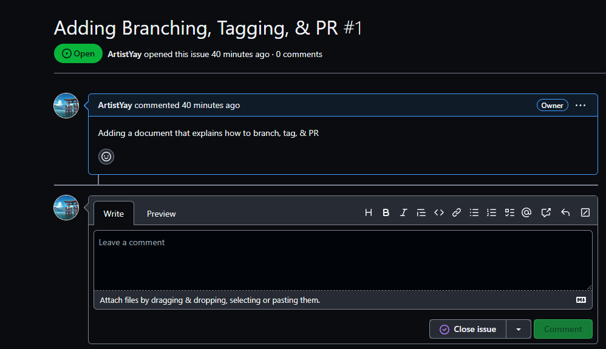
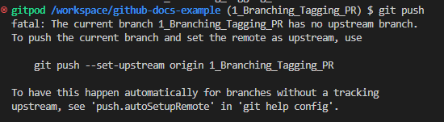
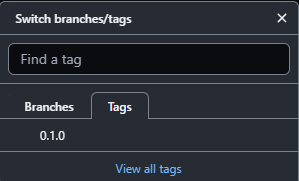
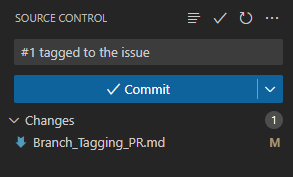

# How do we create a branch, tag the branch, and create a PR to merge the branch?

## Creating a branch
- We want to open a new issue that explains the feature we are trying to implement to our main branch.


> Screenshot of a Github issue made.

- Now that the feature or issue is made we want to create a branch and switch to it, we can do so using this command.

```bash
git checkout -b <name_of_branch>
```
> The ```git checkout -b``` command creates a new branch and checks out to it in one step. This can be useful when you want to start working on a new feature or bug fix without leaving your current branch. To use the command, simply specify the name of the new branch after the ```-b``` option.

- Having to keep up with our changes we want to ```git push``` to our Github but first have to set the branch to upstream.

```bash
git push --set-upstream origin
```


> The ```git push --set-upstream origin``` command pushes your local branch to the remote repository named origin and sets it as the upstream branch. This means that when you run git push without any arguments, git will push your local branch to the remote upstream branch.

## Tagging

- To tag a branch (we will use semactic versioning) we have to use the command:
```bash
git tag
```
>The ```git tag``` command creates a tag in your Git repository. A tag is a lightweight reference to a specific commit in your repository's history. Tags are often used to mark important points in your repository's history, such as release points or major milestones.

- In order to see the tag take into affect use:
```bash
git push --tags
```



- We can also tag the branch commit to an issue.



