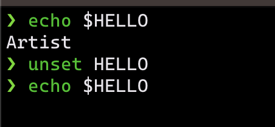

# The importance of Environment Variables :superhero:

For this documentation we are going to go over Environment Variables and why they are important to use especially in cloud security. 

## What are Environment Variables :thinking:

They are just that...variables. Let's say your writing a python script that asks for input from the user. Where would that input be stored? Well that is where enviroment variables come in.

```python
# Ask the user for their name
name = input("What is your name? ")

# Print a greeting to the user
print(f"Hello, {name}!")
```

Environment variables can be used to store sensitive information, such as database passwords and API keys, in a secure way. Meaning you don't have to hard code sensitive credintials or if you need to change something in the code itself you don't have to parse through lines of code and change the value which was mentioned.

## Project Root Env Var 

Let's go ahead and jump into where we used Environment Variables.

- The first thing we have done is run the ```env``` command to show us all the set environment variables.


- To look for a certain variable we used grep:

```bash
env | grep Terraform
```

- We made changes to the bash script file that's in our ```./bin``` folder to ```cd``` into our ```./workspace``` directory, install terraform, then change back into ```./workspace/terraform-beginner-bootcamp-2023```.


- But what if we wanted to make this portible so other developers can use the script. Let's set our variable!


> Made a variable called ```PROJECT_ROOT``` and set the value of the directory we want to change into.

- Another way we can set a variable is use ```export``` and then ```echo``` to check the value.


- To get rid of the value in the variable just use ```unset```.



## Considerations

- If you want Env Vars to persist across all future bash terminals that are open, you need to set env vars in your '.bash_profile'.

- We can persist Env Vars into Gitpod by storing the in Gitpod Secret Storage using the ```gp env <variable='value'>``` command.

- You can also set Env Vars in the '.gitpod.yml' but this can only contain non-sensitive Env Vars.

- Making a '.env.example' file can help people who use your code what Env Vars the code needs to run smoothly.
