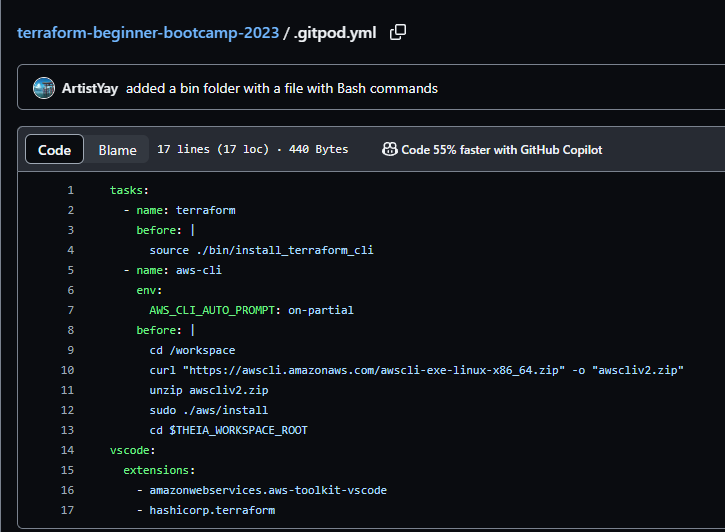

# Solving our Terraform CLI installtion problem :scream:

- Like a good engineer we always want to open a issue and create a new branch which we will work out of.
  
  

- Now let's get to work! So when launching the Gitpod workspace the installation does not complete because there is supposed to be some human interaction.

- We want to know which command is asking for the interaction so we go line by line and test how each command reacts.

  

- While going line by line we notice there is an error of ```apt-key is deprecated. Manage keyring files in trusted.gpg.d instead (see apt-key(8))``` due to GPG keyring changes.

- Now my thought process was to Google the error code, which I did [<sup>[1]</sup>](#references), and see if I can find a solution but instead Andrew realized maybe the commands he was using was out of date and proceed to look up the documentation on how to install the Terraform CLI.[<sup>[2]</sup>](#references)

- Having to create another folder called 'bin' we also created a file to store the commands from the Terraform documentation and run them as a script when called with ```source ./bin/install_terraform_cli``` in the YAML file. We wanted to keep the file tidy and for better portability that's why we went that route.

- Before running the script we had to change permissions on the file which had ```-rw-r--r--``` rights to  an executable, we changed the permisions using ```chmod```[<sup>[3]</sup>](#references)

  ```bash
  u+x ./bin/install_terraform_cli
  ```
  > This command means we are giving the user excutable rights.
  
- After we change the file's permissions we went ahead and make changes to our Gitpod YAML file but there was a coding trap which Andrew thankfully pointed out. For some reason when restarting our Gitpod workspace after shutting it down the Gitpod task does not run ```init``` but instead it runs ```before``[<sup>[4]</sup>](#references)

   

- Lastly, we have to change all our ```init``` in the YAML file to ```before``` to get the script working.
 
   
   > Script that installs Terraform.
     
   
   > YAML file calling the script.
   

## Considerations 

This project was built aganist Ubuntu. You can check the OS flavor in Linux running the ```cat /etc/os-release``` command.


## References

- [Apt-key is deprecated](https://www.google.com/search?q=apt-key+is+deprecated.+Manage+keyring+files+in+trusted.gpg.d+instead+%28see+apt-key%288%29%29+terraform+cli&sca_esv=566603731&sxsrf=AM9HkKkADyeGGZ_S825Np-HmmqvaDjIiAA%3A1695130597539&ei=5aMJZfy0IO-8kPIPlteswAM&ved=0ahUKEwi8u_TI5baBAxVvHkQIHZYrCzgQ4dUDCBA&uact=5&oq=apt-key+is+deprecated.+Manage+keyring+files+in+trusted.gpg.d+instead+%28see+apt-key%288%29%29+terraform+cli&gs_lp=Egxnd3Mtd2l6LXNlcnAiY2FwdC1rZXkgaXMgZGVwcmVjYXRlZC4gTWFuYWdlIGtleXJpbmcgZmlsZXMgaW4gdHJ1c3RlZC5ncGcuZCBpbnN0ZWFkIChzZWUgYXB0LWtleSg4KSkgdGVycmFmb3JtIGNsaUgAUABYAHAAeAGQAQCYAQCgAQCqAQC4AQPIAQD4AQHiAwQYACBB&sclient=gws-wiz-serp)<sup>[1]</sup>

- [Terraform CLI Installation](https://developer.hashicorp.com/terraform/tutorials/aws-get-started/install-cli)<sup>[2]</sup>

- [How to change permissions using chmod](https://en.wikipedia.org/wiki/Chmod#:~:text=In%20Unix%20and%20Unix%2Dlike,objects%20(files%20and%20directories).)<sup>[3]</sup>

- [GitPod lifecycle](https://www.gitpod.io/docs/configure/workspaces/tasks)<sup>[4]</sup>
