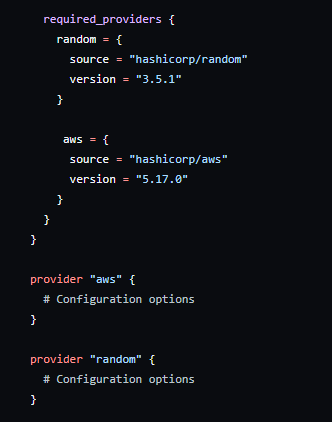
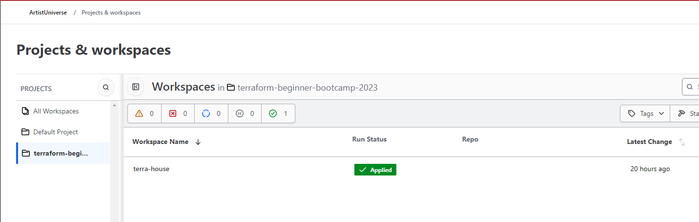
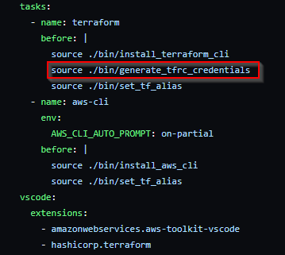
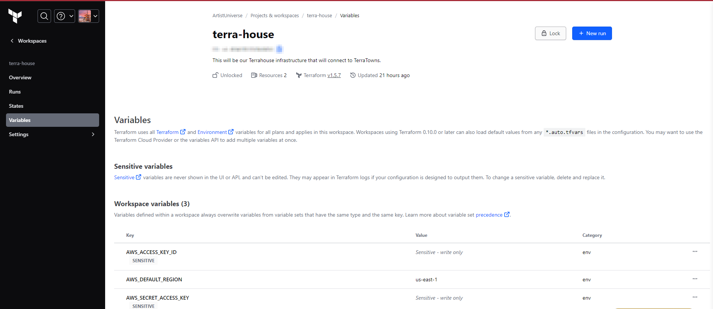

# Terraform State: A Secure :house: in the :cloud:
For this documentation I will explain the process on how we created a randomaly named S3 bucket and migrated our Terraform state file to Terraform cloud.

## Random Name S3 :bucket:
- First thing we want to figure out is how our we going to randomly generate a bucket name. Terraform has a random provider[<sup>[1]</sup>](#references) that can do just that!

 ```
terraform {
  required_providers {
    random = {
      source = "hashicorp/random"
      version = "3.5.1"
    }
  }
}

provider "random" {
  # Configuration options
}
```

- Afterwards we want to use the random string resource block, since AWS has specifications on the bucketing naming[<sup>[2]</sup>](#references) we have to make sure we our following those rules.

```
resource "random_string" "bucket_name" {
  length           = 32
  special          = false
  lower            = true
  upper            = false
```

- Now to create the bucket, we are going to insert the AWS provider[<sup>[3]</sup>](#references) block in our `.main.tf` file.

  
  > I forgot to insert the provider block and got an error when running apply.
  
- Next we are going to call the output we got for the `random_string` resource and have it as a value for our bucket name.

```tf
# Creating a S3 bucket and getting the output name and placing it as the value.
resource "aws_s3_bucket" "example" {
  bucket = random_string.bucket_name.result
}

output "random_bucket_name" {
  value = random_string.bucket_name.result
}
```

## Terraform :cloud: Login
 - We want to create an account in Terraform Cloud[<sup>[4]</sup>](#references), make a workspace then a project in the workspace we created.

  
  > A workspace is a container in Terraform Cloud for infrastructure state, configurations, and settings. A project is an overarching effort or goal, potentially consisting of multiple Terraform Cloud workspaces.

- So, how does Terraform Cloud knows to host our Terraform state file? well we have to insert a cloud block[<sup>[5]</sup>](#references) into our `.main.tf` file.

```tf
terraform {
  cloud {
    organization = "ORGANIZATION-NAME"
    workspaces {
      name = "learn-terraform-cloud-migrate"
    }
  }
```

- When running `terraform plan` we will get an error telling us to create a token for sign-in in Terraform Cloud. Everytime you spin up a Gitpod workspace everything will be refreshed except for the Gitpod Secrets Manager[<sup>[6]</sup>](#references). So how we do we work around this? good question.

- Terraform stores the token in a JSON structured[<sup>[7]</sup>](#references) file called `.credentials.tfrc.json`. We have to create a bash script that creates the file when starting a Gitpod workspace.

```bash
#!/usr/bin/env bash

# Define target directory and file
TARGET_DIR="/home/gitpod/.terraform.d"
TARGET_FILE="${TARGET_DIR}/credentials.tfrc.json"

# Check if TERRAFORM_CLOUD_TOKEN is set
if [ -z "$TERRAFORM_CLOUD_TOKEN" ]; then
    echo "Error: TERRAFORM_CLOUD_TOKEN environment variable is not set."
    exit 1
fi

# Check if directory exists, if not, create it
if [ ! -d "$TARGET_DIR" ]; then
    mkdir -p "$TARGET_DIR"
fi

# Generate credentials.tfrc.json with the token
cat > "$TARGET_FILE" << EOF
{
  "credentials": {
    "app.terraform.io": {
      "token": "$TERRAFORM_CLOUD_TOKEN"
    }
  }
}
EOF

echo "${TARGET_FILE} has been generated."
```
- Let's give the right permissions for the file.

```bash
chmod u+x ./bin/<NAME_OF_BASH_SCRIPT>
```
- And change our YAML file to run the executable.

  

- This next part I had a couple of errors I ran into. First was the provider block I explained earlier and second, Terraform could not read my AWS credentials even though I had stored them in the Gitpod environment variables.

- To work around this I had to go into Terraform Cloud and under workspaces I could specify my variables[<sup>[8]</sup>](#references).

  

- After running terraform init, plan, and apply I was finally able to get the code to work and Terraform Cloud to host the state file.

## Considerations
- If you started to make changes to a file without creating an issue. Go ahead and create one, then create the branch in that issue. Swtich back to the Gitpod workspace and `git pull` and `git fetch` to pull any changes from the repo. You want to save you work before switching to that branch and you can do so using `git add .` then `git stash save`. Switch to the branch using `git checkout <BRANCH_NAME>` and get the files using `git stash apply`.
  
## References

- [Terraform Random Provider](https://registry.terraform.io/providers/hashicorp/random/3.5.1)<sup>[1]</sup>

- [Bucket Naming](https://docs.aws.amazon.com/AmazonS3/latest/userguide/bucketnamingrules.html)<sup>[2]</sup>

- [Terraform AWS Provider](https://registry.terraform.io/providers/hashicorp/aws/5.17.0)<sup>[3]</sup>

- [Terraform Cloud](https://app.terraform.io/)<sup>[4]</sup>

- [Terraform Cloud Block](https://developer.hashicorp.com/terraform/tutorials/cloud/cloud-migrate)<sup>[5]</sup>

- [Gitpod Env Var](https://www.gitpod.io/docs/configure/projects/environment-variables)<sup>[6]</sup>

- [Terraform JSON Structure](https://www.reddit.com/r/Terraform/comments/rtl5ey/can_anyone_please_show_me_show_me_how/)<sup>[7]</sup>

- [Terraform Env Var](https://developer.hashicorp.com/terraform/tutorials/cloud-get-started/cloud-create-variable-set)<sup>[8]</sup>
