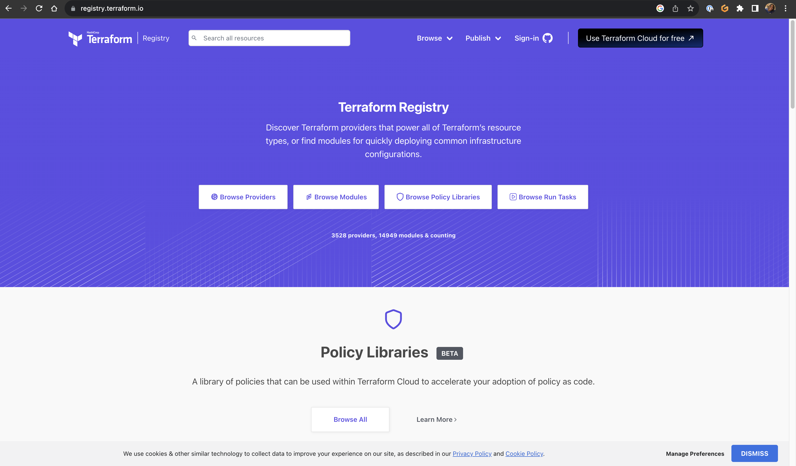
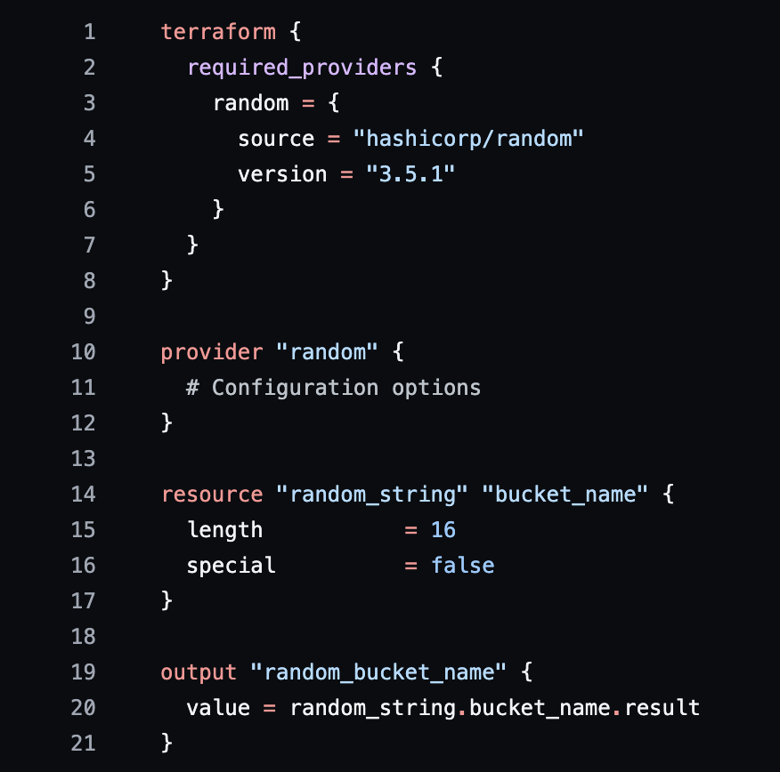
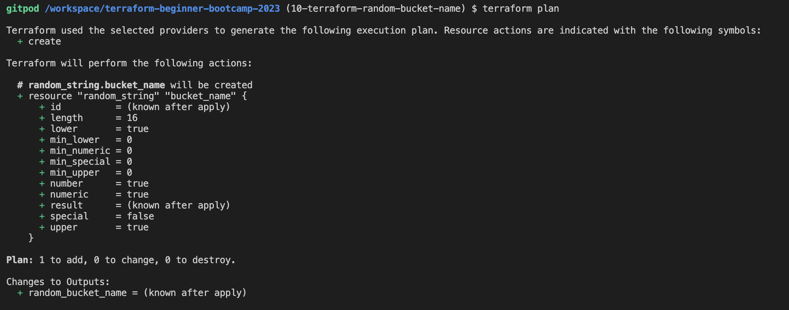

# Terraforming :bucket: Names: A Random Approach

We are officialy half way through week 0 of the Terraform bootcamp and I have offically learned alot! From learning how to create a GitHub issue to tagging the branch with Semantic Versioning, it's been a trip already.

In this write-up I wanted to talk about how we used Terraform to generate a random name, which I am sure will be useful when we create buckets in AWS using Terraform. Now let's hop into it :sunglasses:

## Exploring the Terraform registry

The first thing Andrew and I did was explore a magical website where I'll be spending most of my time in and it's called the Terraform registry [<sup>[1]</sup>](#references)



He taught me that **providers** is an interface to APIs that will allow to create resources in Terrafrom and **Modules** are a way to make large amounts of Terraform code modular, portable and shareable.

## Installing the Terraform random provider

The registry is the place to be ya'll! Utilizing the search bar we found the page to install the random provider [<sup>[2]</sup>](#references) in our ```main.tf``` file. Everything is coming from the Terraform random provider [<sup>[3]</sup>](#references) docs in the registry.


> For this code we didn't want to use any special characters becuase of AWS rules, even though we didn't deploy any buckets it was best practice to change it to false.

Next, we wanted to output our randomly generated name using the ```output```

```sh
output "random_bucket_name" {
  value = random_string.bucket_name.result
```

After we coded the our file in our ```main.tf``` file we are ready to initilize using:

```sh
terraform init
```
> This command will download the binaries for the Terraform providers.

## Generating and outputting a random bucket name

For this last step we want to make sure our Terraform code is working as planned, we want to run:

```sh
terraform plan
```
> This will generate out a changeset, about the state of our infrastructure and what will be changed.



Lastly, lets run ```terraform apply --auto-approve``` to get our random name. This will run a plan and pass the changeset to be executed by Terraform.


## Considerations

- `.terraform.lock.hcl` contains the locked versioning for the providers or modules that should be used with this project. The Terraform lock file should be committed to your Version Control System (VSC) eg. Github.
  
- `.terraform.tfstate` contains information about the current state of your infrastructure. This file **should not be commited** to your VCS, a `.gitignore` file should be made. This file can contain sensitive data. If you lose this file, you lose knowing the state of your infrastructure.

- `.terraform.tfstate.backup` is the previous state file.

- `.terraform` directory contains binaries of Terraform providers.

## References

- [Terraform Registry](https://registry.terraform.io/)

- [Terraform Random Page](https://registry.terraform.io/providers/hashicorp/random/latest)

- [Terraform Random Documentation](https://registry.terraform.io/providers/hashicorp/random/latest/docs)
