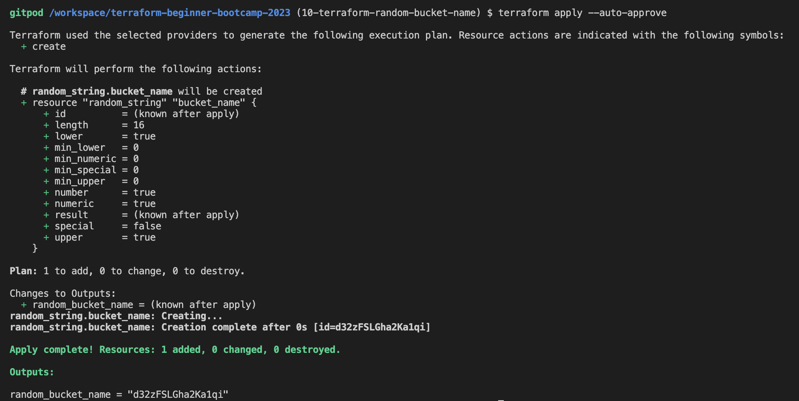

## Table Of Contents
- [How do we create a branch, tag the branch, and create a PR to merge the branch?](#how-do-we-create-a-branch--tag-the-branch--and-create-a-pr-to-merge-the-branch-)
  * [Creating a branch](#creating-a-branch)
  * [Tagging](#tagging)
  * [Pull Request (PR)](#pull-request--pr-)
- [Solving our Terraform CLI installtion problem :scream:](#solving-our-terraform-cli-installtion-problem--scream-)
- [The importance of Environment Variables :superhero:](#the-importance-of-environment-variables--superhero-)
  * [What are Environment Variables :thinking:](#what-are-environment-variables--thinking-)
  * [Project Root Env Var](#project-root-env-var)
- [Terraforming :bucket: Names: A Random Approach](#terraforming--bucket--names--a-random-approach)
  * [Exploring the Terraform registry](#exploring-the-terraform-registry)
  * [Installing the Terraform random provider](#installing-the-terraform-random-provider)
  * [Generating and outputting a random bucket name](#generating-and-outputting-a-random-bucket-name)
  * [AWS CLI in a Snap :recycle:](#aws-cli-in-a-snap--recycle-)
- [Terraform State: A Secure :house: in the :cloud:](#terraform-state--a-secure--house--in-the--cloud-)
  * [Random Name S3 :bucket:](#random-name-s3--bucket-)
  * [Terraform :cloud: Login](#terraform--cloud--login)
  * [Considerations](#considerations)
  * [References](#references)

# How do we create a branch, tag the branch, and create a PR to merge the branch?

## Creating a branch
- We want to open a new issue that explains the feature we are trying to implement to our main branch.


> Screenshot of a Github issue made.

- Now that the feature or issue is made we want to create a branch and switch to it, we can do so using this command.

```bash
git checkout -b <name_of_branch>
```
> The ```git checkout -b``` command creates a new branch and checks out to it in one step. This can be useful when you want to start working on a new feature or bug fix without leaving your current branch. To use the command, simply specify the name of the new branch after the ```-b``` option.

- Having to keep up with our changes we want to ```git push``` to our Github but first have to set the branch to upstream.

```bash
git push --set-upstream origin
```


> The ```git push --set-upstream origin``` command pushes your local branch to the remote repository named origin and sets it as the upstream branch. This means that when you run git push without any arguments, git will push your local branch to the remote upstream branch.

## Tagging

- To tag a branch (we will use semactic versioning) we have to use the command:
```bash
git tag
```
>The ```git tag``` command creates a tag in your Git repository. A tag is a lightweight reference to a specific commit in your repository's history. Tags are often used to mark important points in your repository's history, such as release points or major milestones.

- In order to see the tag take into affect use:
```bash
git push --tags
```


- We can also tag the branch commit to an issue.


## Pull Request (PR)
- Let's run down what we have done. There was an issue opened for a new feature, we created a new branch to work on the feature becuase we didn't want to merge any changes to the main branch because we can introduce bugs, we made the feature and pushed it into the branch and tagged it to the issue.

- Now we need to merge the branch into the main branch so let's create a PR in GitHub.


- We went ahead and made a PR request now we are going to merge it to the main branch.


> For this part we went ahead and merge it to the main branch ourselves but in a real dev environment this PR request will have to be looked over before it is merged.

# Solving our Terraform CLI installtion problem :scream:

- Like a good engineer we always want to open a issue and create a new branch which we will work out of.
  
  

- Now let's get to work! So when launching the Gitpod workspace the installation does not complete because there is supposed to be some human interaction.

- We want to know which command is asking for the interaction so we go line by line and test how each command reacts.

  

- While going line by line we notice there is an error of ```apt-key is deprecated. Manage keyring files in trusted.gpg.d instead (see apt-key(8))``` due to GPG keyring changes.

- Now my thought process was to Google the error code, which I did [<sup>[1]</sup>](#references), and see if I can find a solution but instead Andrew realized maybe the commands he was using was out of date and proceed to look up the documentation on how to install the Terraform CLI.[<sup>[2]</sup>](#references)

- Having to create another folder called 'bin' we also created a file to store the commands from the Terraform documentation and run them as a script when called with ```source ./bin/install_terraform_cli``` in the YAML file. We wanted to keep the file tidy and for better portability that's why we went that route.

- Before running the script we had to change permissions on the file which had ```-rw-r--r--``` rights to  an executable, we changed the permisions using ```chmod```[<sup>[3]</sup>](#references)

  ```bash
  u+x ./bin/install_terraform_cli
  ```
  > This command means we are giving the user excutable rights.
  
- After we change the file's permissions we went ahead and make changes to our Gitpod YAML file but there was a coding trap which Andrew thankfully pointed out. For some reason when restarting our Gitpod workspace after shutting it down the Gitpod task does not run ```init``` but instead it runs ```before``[<sup>[4]</sup>](#references)

   

- Lastly, we have to change all our ```init``` in the YAML file to ```before``` to get the script working.
 
   
   > Script that installs Terraform.
     
   
   > YAML file calling the script.
   
# The importance of Environment Variables :superhero:

For this documentation we are going to go over Environment Variables and why they are important to use especially in cloud security. 

## What are Environment Variables :thinking:

They are just that...variables. Let's say your writing a python script that asks for input from the user. Where would that input be stored? Well that is where enviroment variables come in.

```python
# Ask the user for their name
name = input("What is your name? ")

# Print a greeting to the user
print(f"Hello, {name}!")
```

Environment variables can be used to store sensitive information, such as database passwords and API keys, in a secure way. Meaning you don't have to hard code sensitive credintials or if you need to change something in the code itself you don't have to parse through lines of code and change the value which was mentioned.

## Project Root Env Var 

Let's go ahead and jump into where we used Environment Variables.

- The first thing we have done is run the ```env``` command to show us all the set environment variables.


- To look for a certain variable we used grep:

```bash
env | grep Terraform
```

- We made changes to the bash script file that's in our ```./bin``` folder to ```cd``` into our ```./workspace``` directory, install terraform, then change back into ```./workspace/terraform-beginner-bootcamp-2023```.


- But what if we wanted to make this portible so other developers can use the script. Let's set our variable!


> Made a variable called ```PROJECT_ROOT``` and set the value of the directory we want to change into.

- Another way we can set a variable is use ```export``` and then ```echo``` to check the value.


- To get rid of the value in the variable just use ```unset```.


# Terraforming :bucket: Names: A Random Approach

We are officialy half way through week 0 of the Terraform bootcamp and I have offically learned alot! From learning how to create a GitHub issue to tagging the branch with Semantic Versioning, it's been a trip already.

In this write-up I wanted to talk about how we used Terraform to generate a random name, which I am sure will be useful when we create buckets in AWS using Terraform. Now let's hop into it :sunglasses:

## Exploring the Terraform registry

The first thing Andrew and I did was explore a magical website where I'll be spending most of my time in and it's called the Terraform registry [<sup>[5]</sup>](#references)


He taught me that **providers** is an interface to APIs that will allow to create resources in Terrafrom and **Modules** are a way to make large amounts of Terraform code modular, portable and shareable.

## Installing the Terraform random provider

The registry is the place to be ya'll! Utilizing the search bar we found the page to install the random provider [<sup>[6]</sup>](#references) in our ```main.tf``` file. Everything is coming from the Terraform random provider [<sup>[7]</sup>](#references) docs in the registry.


> For this code we didn't want to use any special characters becuase of AWS rules, even though we didn't deploy any buckets it was best practice to change it to false.

Next, we wanted to output our randomly generated name using the ```output```

```sh
output "random_bucket_name" {
  value = random_string.bucket_name.result
```

After we coded the our file in our ```main.tf``` file we are ready to initilize using:

```sh
terraform init
```
> This command will download the binaries for the Terraform providers.

## Generating and outputting a random bucket name

For this last step we want to make sure our Terraform code is working as planned, we want to run:

```sh
terraform plan
```
> This will generate out a changeset, about the state of our infrastructure and what will be changed.


Lastly, lets run ```terraform apply --auto-approve``` to get our random name. This will run a plan and pass the changeset to be executed by Terraform.



## AWS CLI in a Snap :recycle:

This prerequiste is the same from last time. We had to create another file in bin called `.install_aws_cli` and added the commands that installed the CLI[<sup>[8]</sup>](#references).

```bash
#!/usr/bin/env bash

cd /workspace

curl "https://awscli.amazonaws.com/awscli-exe-linux-x86_64.zip" -o "awscliv2.zip"
unzip awscliv2.zip
sudo ./aws/install

cd $PROJECT_ROOT
```
Afterwards, we had to change the permissions of the file to make sure whenever the workspace get launched again it is executable.

```bash
chmod u+x ./bin/install_aws_cli
```
Next, I changed the YAML to exectue the file using source.


Lastly, we had to set the environment variables[<sup>[9]</sup>](#references) in the Gitpod secret manager using the ```gp env``` command.

```bash
gp env AWS_ACCESS_KEY_ID=' '
gp env AWS_SECRET_ACCESS_KEY=' '
gp env AWS_DEFAULT_REGION=us-east-1
```

And whenever we start the workspace and do a `aws sts get-caller-identity`[<sup>[10]</sup>](#references) we get JSON code confirming we are using the credentials.

```json
{
    "UserId": "AIDASAMPLEUSERID",
    "Account": "123456789012",
    "Arn": "arn:aws:iam::123456789012:user/DevAdmin"
}
```

We're gonna commit our changes, make a PR, and tag our main branch with ```0.4.0```.

# Terraform State: A Secure :house: in the :cloud:
For this documentation I will explain the process on how we created a randomaly named S3 bucket and migrated our Terraform state file to Terraform cloud.

## Random Name S3 :bucket:
- First thing we want to figure out is how our we going to randomly generate a bucket name. Terraform has a random provider[<sup>[13]</sup>](#references) that can do just that!

 ```
terraform {
  required_providers {
    random = {
      source = "hashicorp/random"
      version = "3.5.1"
    }
  }
}

provider "random" {
  # Configuration options
}
```

- Afterwards we want to use the random string resource block, since AWS has specifications on the bucketing naming[<sup>[14]</sup>](#references) we have to make sure we our following those rules.

```
resource "random_string" "bucket_name" {
  length           = 32
  special          = false
  lower            = true
  upper            = false
```

- Now to create the bucket, we are going to insert the AWS provider[<sup>[15]</sup>](#references) block in our `.main.tf` file.

  
  > I forgot to insert the provider block and got an error when running apply.
  
- Next we are going to call the output we got for the `random_string` resource and have it as a value for our bucket name.

```tf
# Creating a S3 bucket and getting the output name and placing it as the value.
resource "aws_s3_bucket" "example" {
  bucket = random_string.bucket_name.result
}

output "random_bucket_name" {
  value = random_string.bucket_name.result
}
```

## Terraform :cloud: Login
 - We want to create an account in Terraform Cloud[<sup>[16]</sup>](#references), make a workspace then a project in the workspace we created.

  
  > A workspace is a container in Terraform Cloud for infrastructure state, configurations, and settings. A project is an overarching effort or goal, potentially consisting of multiple Terraform Cloud workspaces.

- So, how does Terraform Cloud knows to host our Terraform state file? well we have to insert a cloud block[<sup>[17]</sup>](#references) into our `.main.tf` file.

```tf
terraform {
  cloud {
    organization = "ORGANIZATION-NAME"
    workspaces {
      name = "learn-terraform-cloud-migrate"
    }
  }
```

- When running `terraform plan` we will get an error telling us to create a token for sign-in in Terraform Cloud. Everytime you spin up a Gitpod workspace everything will be refreshed except for the Gitpod Secrets Manager[<sup>[18]</sup>](#references). So how we do we work around this? good question.

- Terraform stores the token in a JSON structured[<sup>[19]</sup>](#references) file called `.credentials.tfrc.json`. We have to create a bash script that creates the file when starting a Gitpod workspace.

```bash
#!/usr/bin/env bash

# Define target directory and file
TARGET_DIR="/home/gitpod/.terraform.d"
TARGET_FILE="${TARGET_DIR}/credentials.tfrc.json"

# Check if TERRAFORM_CLOUD_TOKEN is set
if [ -z "$TERRAFORM_CLOUD_TOKEN" ]; then
    echo "Error: TERRAFORM_CLOUD_TOKEN environment variable is not set."
    exit 1
fi

# Check if directory exists, if not, create it
if [ ! -d "$TARGET_DIR" ]; then
    mkdir -p "$TARGET_DIR"
fi

# Generate credentials.tfrc.json with the token
cat > "$TARGET_FILE" << EOF
{
  "credentials": {
    "app.terraform.io": {
      "token": "$TERRAFORM_CLOUD_TOKEN"
    }
  }
}
EOF

echo "${TARGET_FILE} has been generated."
```
- Let's give the right permissions for the file.

```bash
chmod u+x ./bin/<NAME_OF_BASH_SCRIPT>
```
- And change our YAML file to run the executable.

  

- This next part I had a couple of errors I ran into. First was the provider block I explained earlier and second, Terraform could not read my AWS credentials even though I had stored them in the Gitpod environment variables.

- To work around this I had to go into Terraform Cloud and under workspaces I could specify my variables[<sup>[20]</sup>](#references).

  

- After running terraform init, plan, and apply I was finally able to get the code to work and Terraform Cloud to host the state file.

## Considerations 

- This project was built aganist Ubuntu. You can check the OS flavor in Linux running the ```cat /etc/os-release``` command.

- If you want Env Vars to persist across all future bash terminals that are open, you need to set env vars in your '.bash_profile'.

- We can persist Env Vars into Gitpod by storing the in Gitpod Secret Storage using the ```gp env <variable='value'>``` command.

- You can also set Env Vars in the '.gitpod.yml' but this can only contain non-sensitive Env Vars.

- Making a '.env.example' file can help people who use your code what Env Vars the code needs to run smoothly.

- `.terraform.lock.hcl` contains the locked versioning for the providers or modules that should be used with this project. The Terraform lock file should be committed to your Version Control System (VSC) eg. Github.
  
- `.terraform.tfstate` contains information about the current state of your infrastructure. This file **should not be commited** to your VCS, a `.gitignore` file should be made. This file can contain sensitive data. If you lose this file, you lose knowing the state of your infrastructure.

- `.terraform.tfstate.backup` is the previous state file.

- `.terraform` directory contains binaries of Terraform providers.

- I had some security concerns especially using env var to store them. You should **NEVER** hard code credintials in a file or in a cloud development environment aka the ```gp env``` common but since this is a bootcamp and my IAM user will temporary we chose this route. I asked Andrew in the Discord server for any best practices he knows of and this was his response.
  


> Had another bootcamper give his security suggestions[<sup>[11]</sup>](#references)[<sup>[12]</sup>](#references)

-  We'll need to generate AWS CLI credentials from the IAM service in the portal in order to use the AWS CLI. Security best practice is to set MFA so don't forget to do that.

- You prevent environment variables from being committed to your repository when configuring AWS credentials for Terraform by storing the environment variables in a separate file and adding it to the `.gitignore` file.

- If you started to make changes to a file without creating an issue. Go ahead and create one, then create the branch in that issue. Swtich back to the Gitpod workspace and `git pull` and `git fetch` to pull any changes from the repo. You want to save you work before switching to that branch and you can do so using `git add .` then `git stash save`. Switch to the branch using `git checkout <BRANCH_NAME>` and get the files using `git stash apply`.

## References

- [Apt-key is deprecated](https://www.google.com/search?q=apt-key+is+deprecated.+Manage+keyring+files+in+trusted.gpg.d+instead+%28see+apt-key%288%29%29+terraform+cli&sca_esv=566603731&sxsrf=AM9HkKkADyeGGZ_S825Np-HmmqvaDjIiAA%3A1695130597539&ei=5aMJZfy0IO-8kPIPlteswAM&ved=0ahUKEwi8u_TI5baBAxVvHkQIHZYrCzgQ4dUDCBA&uact=5&oq=apt-key+is+deprecated.+Manage+keyring+files+in+trusted.gpg.d+instead+%28see+apt-key%288%29%29+terraform+cli&gs_lp=Egxnd3Mtd2l6LXNlcnAiY2FwdC1rZXkgaXMgZGVwcmVjYXRlZC4gTWFuYWdlIGtleXJpbmcgZmlsZXMgaW4gdHJ1c3RlZC5ncGcuZCBpbnN0ZWFkIChzZWUgYXB0LWtleSg4KSkgdGVycmFmb3JtIGNsaUgAUABYAHAAeAGQAQCYAQCgAQCqAQC4AQPIAQD4AQHiAwQYACBB&sclient=gws-wiz-serp)<sup>[1]</sup>

- [Terraform CLI Installation](https://developer.hashicorp.com/terraform/tutorials/aws-get-started/install-cli)<sup>[2]</sup>

- [How to change permissions using chmod](https://en.wikipedia.org/wiki/Chmod#:~:text=In%20Unix%20and%20Unix%2Dlike,objects%20(files%20and%20directories).)<sup>[3]</sup>

- [GitPod lifecycle](https://www.gitpod.io/docs/configure/workspaces/tasks)<sup>[4]</sup>

- [Terraform Registry](https://registry.terraform.io/)<sup>[5]</sup>

- [Terraform Random Page](https://registry.terraform.io/providers/hashicorp/random/latest)<sup>[6]</sup>

- [Terraform Random Documentation](https://registry.terraform.io/providers/hashicorp/random/latest/docs)<sup>[7]</sup>

- [AWS CLI Install](https://docs.aws.amazon.com/cli/latest/userguide/getting-started-install.html)<sup>[8]</sup>

- [AWS CLI Env Var](https://docs.aws.amazon.com/cli/latest/userguide/cli-configure-envvars.html)<sup>[9]</sup>

- [AWS STS get-caller-identity](https://docs.aws.amazon.com/cli/latest/reference/sts/get-caller-identity.html)<sup>[10]</sup>

- [AWS SSO](https://docs.aws.amazon.com/cli/latest/userguide/cli-configure-sso.html)<sup>[11]</sup>

- [AWS Vault](https://github.com/99designs/aws-vault)<sup>[12]</sup>

- [Terraform Random Provider](https://registry.terraform.io/providers/hashicorp/random/3.5.1)<sup>[13]</sup>

- [Bucket Naming](https://docs.aws.amazon.com/AmazonS3/latest/userguide/bucketnamingrules.html)<sup>[14]</sup>

- [Terraform AWS Provider](https://registry.terraform.io/providers/hashicorp/aws/5.17.0)<sup>[15]</sup>

- [Terraform Cloud](https://app.terraform.io/)<sup>[16]</sup>

- [Terraform Cloud Block](https://developer.hashicorp.com/terraform/tutorials/cloud/cloud-migrate)<sup>[17]</sup>

- [Gitpod Env Var](https://www.gitpod.io/docs/configure/projects/environment-variables)<sup>[18]</sup>

- [Terraform JSON Structure](https://www.reddit.com/r/Terraform/comments/rtl5ey/can_anyone_please_show_me_show_me_how/)<sup>[19]</sup>

- [Terraform Env Var](https://developer.hashicorp.com/terraform/tutorials/cloud-get-started/cloud-create-variable-set)<sup>[20]</sup>
