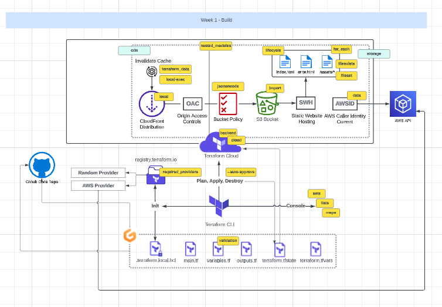

## References

- [Standard Module Structure](https://developer.hashicorp.com/terraform/language/modules/develop/structure)[1]

- [GitHub Wiki TOC generator](https://ecotrust-canada.github.io/markdown-toc/)[2]

- [Terraform Import](https://developer.hashicorp.com/terraform/cli/import)[3]

- [Terraform Module Sources](https://developer.hashicorp.com/terraform/language/modules/sources)[4]

- [Terraform References to Named Values](https://developer.hashicorp.com/terraform/language/expressions/references#filesystem-and-workspace-info)[5]

- [ETag](https://developer.mozilla.org/en-US/docs/Web/HTTP/Headers/ETag)[6]

- [FileMD5 Function](https://developer.hashicorp.com/terraform/language/functions/filemd5)[7]

- [Terraform Lifecycle](https://developer.hashicorp.com/terraform/language/meta-arguments/lifecycle)[8]

- [AWS OAC](https://aws.amazon.com/blogs/networking-and-content-delivery/amazon-cloudfront-introduces-origin-access-control-oac/)[9]

- [Terraform Strings & Templates](https://developer.hashicorp.com/terraform/language/expressions/strings)[10]

- [HTTP-Server](https://www.npmjs.com/package/http-server)[11]

- [Terraform For_Each](https://developer.hashicorp.com/terraform/language/meta-arguments/for_each)[12]

- [Terraform Local-Exec](https://developer.hashicorp.com/terraform/language/resources/provisioners/local-exec)[13]

- [Terraform Fileset Function](https://developer.hashicorp.com/terraform/language/functions/fileset)[1]4
