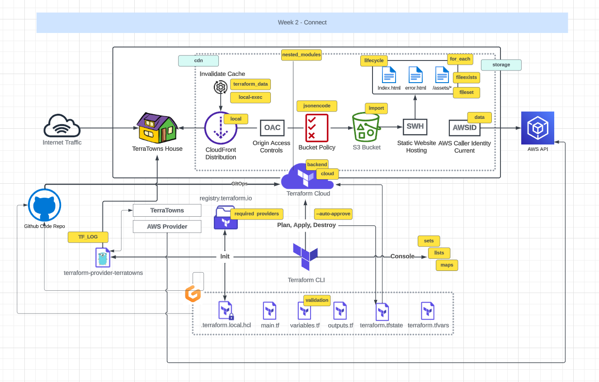

# Terraform Beginner Bootcamp 2023 - Week 2



# Table of contents

- [Setting Up Terratowns Mock :globe_with_meridians: Server](#setting-up-terratowns-mock-globe_with_meridians-server)
- [Setup :skull: For Custom Terraform Provider](#setup-skull-for-custom-terraform-provider)
- [Provider Block for Custom Terraform Provider](#provider-block-for-custom-terraform-provider)
- [Implementing CRUD](#implementing-crud)
- [References](#references)


## Setting Up Terratowns Mock :globe_with_meridians: Server

- Bundler is a package manager for Ruby. It is the primary way to install Ruby packages. You need to create a Gemfile and define your gems in that file.

```
source "https://rubygems.org"

gem 'sinatra'
gem 'rake'
gem 'pry'
gem 'puma'
gem 'activerecord'
```
> Run the `bundle install` command to install the gems on the system globally.

- A `Gemfile.lock` file will be created to lock down the gem versions used in this project.

- We have to use `bundle exec` to tell future Ruby scripts to use the gems we installed. This is the way we set context.

- Sinatra[<sup>[1]</sup>](#references) is a micro web-framework for Ruby to build web apps. Its great for mock or development servers or for very simple projects. You can create a web-server in a single file.

- We can run the web server by executing the following commands in the YAML file:

```
 bundle install
      bundle exec ruby server.rb
```

- All the code for our server is stored in the `server.rb` file.

- Run `./bin/terratowns/create` to get the Uuid and then `./bin/terratowns/read <uuid>` to get back a payload.

## Setup :skull: For Custom Terraform Provider

- We are setting up the provider in Go lang. The first thing is make a `main.go` file and specfic it's a package. The main package is special in Go, it's where the execution of the program starts.

- Most of the notes will be in the code as comments.

- The primary purpose of the `terraform.rc` file is to override default settings and specify where to look for custom providers.

- `import fmt` in the Golang is used to format IO functions.

- To initialize the directory for Terraform provider in Golang is `go mod init`.

- Use `go build -o` to start the build.

## Provider Block for Custom Terraform Provider

- We added a debug command in the YAML file, so whenever we run `tf init` we get debug output.

## Implementing CRUD

- Terraform Provider resources utilize CRUD[<sup>[2]</sup>](#references).

- CRUD stands for Create, Read Update, and Delete

## References

- [Sintra Web Framework](https://sinatrarb.com/)<sup>[1]<sup>

- [CRUD](https://en.wikipedia.org/wiki/Create,_read,_update_and_delete)<sup>[2]<sup>
